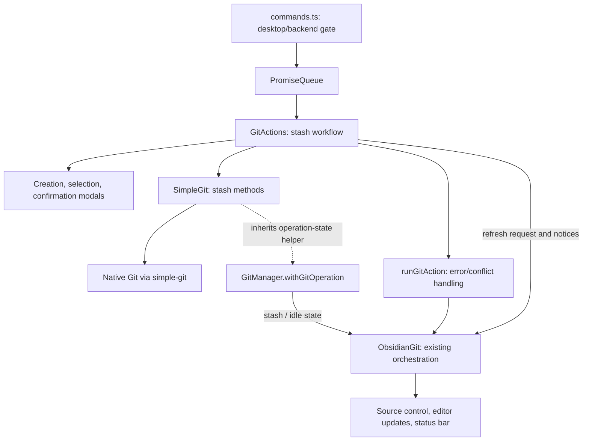

# Desktop stash architecture

This document explains how desktop stash uses the existing Obsidian Git layers.
It follows the command flow and records its safeguards. Implementation decisions
and validation history live in [plan.md](plan.md).

## Connection to the existing architecture

| Existing layer                    | Stash integration                                                                                                                                           |
| --------------------------------- | ----------------------------------------------------------------------------------------------------------------------------------------------------------- |
| User entry points and concurrency | Five palette commands enqueue complete workflows, including dialogs, through the existing `PromiseQueue`.                                                   |
| Git actions                       | `GitActions` coordinates readiness, dialogs, saving open files, backend calls, refresh, and notices.                                                        |
| Git backends                      | Stash methods belong to `SimpleGit`. They inherit `GitManager.withGitOperation`; the shared abstract contract has no stash methods.                         |
| Plugin orchestration and events   | Existing `runGitAction`, conflict handling, and `obsidian-git:refresh` deliver errors and updated file status.                                              |
| UI and editor integration         | New modals collect choices; the existing status bar displays `GitOperation.stash`. Open text views are saved before working-tree changes.                   |
| Tests and build                   | A separate E2E runner tests the production bundle inside real desktop Obsidian. The release still consists of `main.js`, `manifest.json`, and `styles.css`. |

Both command dispatch and the workflow require `Platform.isDesktopApp` and a
`SimpleGit` instance. This follows the existing desktop feature pattern.
`IsomorphicGit` and the shared abstract API retain their existing capabilities.

## Code map

| File                                                       | Responsibility                                                                                                          |
| ---------------------------------------------------------- | ----------------------------------------------------------------------------------------------------------------------- |
| [src/commands.ts](src/commands.ts)                         | Registers `stash-push`, `stash-list`, `stash-apply`, `stash-pop`, and `stash-drop`; applies gates and queues workflows. |
| [src/gitActions.ts](src/gitActions.ts)                     | `stashChanges`, `manageStash`, backend checks, `saveOpenTextFiles`, and result reporting.                               |
| [src/ui/modals/stashModal.ts](src/ui/modals/stashModal.ts) | `StashCreateModal`, `StashSelectModal`, and `StashDropModal`; resolves choices or cancellation.                         |
| [src/gitManager/simpleGit.ts](src/gitManager/simpleGit.ts) | Native operations, repository checks, selected-stash validation, and conflict detection.                                |
| [src/types.ts](src/types.ts)                               | Stash entries/options/results and the appended `GitOperation.stash` value.                                              |
| [src/statusBar.ts](src/statusBar.ts)                       | Archive icon, “Updating stash...” label, and stash-class cleanup.                                                       |

Existing helpers in [src/gitAction.ts](src/gitAction.ts),
[src/promiseQueue.ts](src/promiseQueue.ts),
[src/gitManager/gitManager.ts](src/gitManager/gitManager.ts), and
[src/main.ts](src/main.ts) are reused without changes for this feature.

## Workflow and Git semantics

Creation collects an optional message and **Include untracked files**, enabled
by default. After confirmation, `saveOpenTextFiles` awaits `TextFileView.save()`
for open text views, then calls `stashPush`. Native arguments are passed as an
array, so the message remains one argument. Comparing stash entries before and
after distinguishes creation from a clean-tree no-op without parsing localized
success messages. Ignored files are preserved; the backend never passes `--all`.

List/apply/pop/drop first load `StashEntry[]` and open a fuzzy picker. Each entry
holds a reflog reference, full commit hash, message, and date, parsed from an
explicit NUL-separated Git format. List selection is informational. Apply/pop
offer **Restore staging**, off by default; enabling it passes `--index`. Drop
requires a separate confirmation. Cancelling a dialog makes no Git mutation.
The fuzzy picker defers cancellation to a microtask because Obsidian closes it
before invoking the selection callback.

| Backend method                    | Native operation and outcome                                                                                 |
| --------------------------------- | ------------------------------------------------------------------------------------------------------------ |
| `listStashes()`                   | `git stash list` with explicit fields; empty results are normal.                                             |
| `stashPush(options)`              | `git stash push`, optionally `--include-untracked` and `--message`; returns `stashed` or `nothing-to-stash`. |
| `stashApply(entry, restoreIndex)` | Validates selection, then `git stash apply [--index] <hash>`; retains the stash.                             |
| `stashPop(entry, restoreIndex)`   | Applies, checks conflicts, revalidates, then drops; returns `popped` or `applied-retained`.                  |
| `stashDrop(entry)`                | Validates selection, then `git stash drop <ref>`.                                                            |

Pop uses apply followed by drop so deletion happens only after successful
restoration. If application conflicts, it throws `GitConflictError` and leaves
the saved stash intact. If application succeeds but deletion fails, the workflow
reports **Changes restored; stash retained**. The restored files remain in place;
the user can inspect them before dropping the retained copy.

## Safeguards and state

-   Repository scope is checked against resolved filesystem roots. Only a
    vault-root or nested repository is accepted. Parent repositories are rejected
    regardless of `limitToVault`, because stash can capture index changes outside
    a pathspec. Operations do not recurse into submodules.
-   Push/apply/pop reject unresolved conflicts and merge/rebase/cherry-pick/revert
    metadata. Push also verifies an initial HEAD commit exists. Listing and
    dropping remain available during conflicts, subject to scope/identity checks.
-   Immediately before apply/drop, the recorded reference must still resolve to
    its recorded hash. Apply uses the hash; pop revalidates before dropping the
    reference. External changes to the list cause rejection or retained-copy
    reporting. The queue serializes plugin workflows; these checks do not provide
    an atomic lock against external Git tools.
-   Apply explicitly checks Git status after the native command. E2E exposed
    `simple-git` resolving a conflicting apply when Git exits nonzero but stderr
    is empty; checking unresolved paths prevents an erroneous pop deletion.
-   Mutations run inside inherited `withGitOperation(GitOperation.stash, ...)`.
    Its `finally` restores idle state and clears progress on success or failure.
    `runGitAction` routes conflicts through the existing plugin conflict UI and
    other failures through `displayError`.

Creation and apply/pop request `obsidian-git:refresh` in `finally`, including
partial failure. Existing vault file events update open editors, while the
plugin refresh path updates source control and status. Stash does not move HEAD,
so these workflows do not emit `head-change`.

Automatic routines retain their settings and share the queue. Restored edits
can be committed by later automatic runs; users can pause them with the existing
**Pause/Resume automatic routines** command. Stashes remain local Git data and
are not uploaded by ordinary push/sync. No new persisted settings, background
timers, or permanent views are introduced.

## Validation and local installation

[scripts/e2e/stash.mjs](scripts/e2e/stash.mjs) uses the test-only
`playwright-core` dependency to drive commands and dialogs in real Obsidian with
native Git and a disposable vault/profile. It verifies file bytes, staging, stash
identity, cancellation, conflicts, editor-save timing, queueing, and repository
scope. Each run saves screenshots, Git/file snapshots, the tested bundle,
checksums, and a replay script. All 15 scenarios and a frozen-bundle replay passed
on macOS with Obsidian 1.13.7. See [E2E instructions](tests/e2e/README.md).

The existing build reads the working directory, including uncommitted edits.
Local Obsidian installations load the three release files copied into the
vault's plugin directory; committing or pushing a branch is independent of that
installation. See [local installation](docs/Installation.md#install-this-local-fork)
and [user-facing behavior](docs/Features.md#git-stash-desktop-only).
